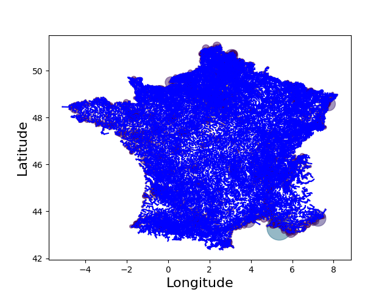
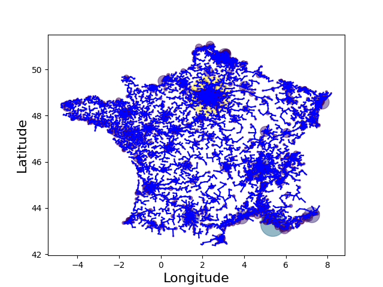
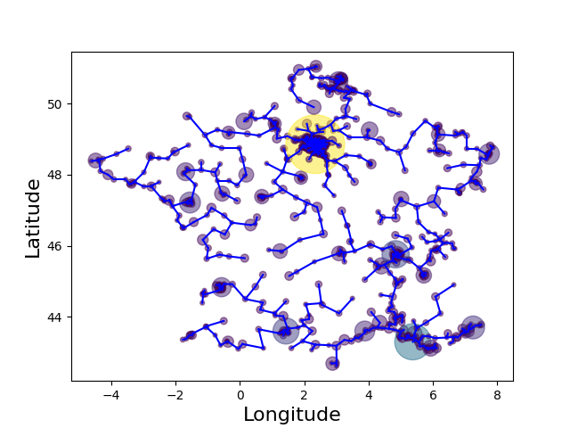
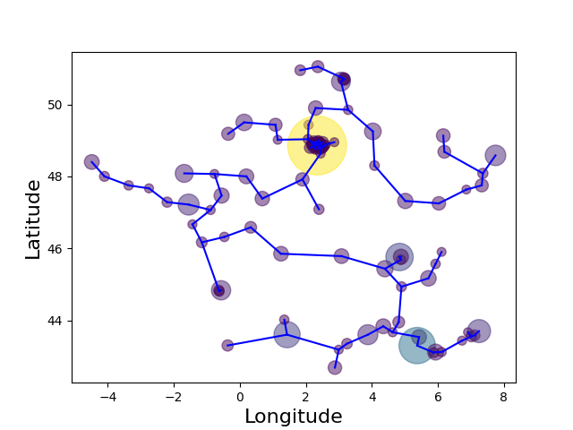
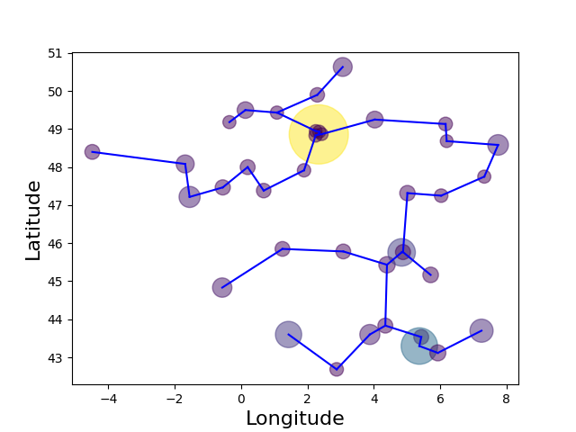
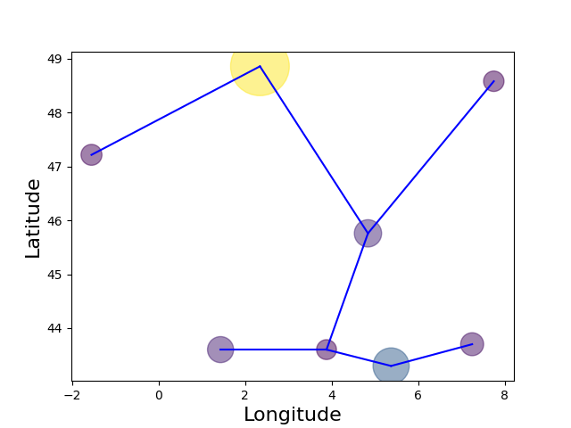

# Projet : Réseau d’Aqueducs
## Choix du langage de programmation
Le C++ a été une évidence pour travailler ce projet car il s'agit d'un langage tout d'abord extrèmement performant mais aussi permettant une abstraction quasi totale. En C++ il est possible de rédiger du code d'une manière mathématiquement rigoureuse tout en exploitant la généricité. Il est possible de poser des assertions sur les types avant la compilation.
## Algorithmes
L'algorithme de Dijsktra a été préféré à celui glouton car le problème de base se résout à déterminer le plus court chemin d'un graphe complet.
### 1
Le principe de cet algorithme est de prendre un ensemble de sommets indicés quelconques ainsi qu'une fonction de coût. La fonction associée est celle qui se rapproche le plus des définitions mathématiques des graphes. Cette fonction a l'avantage d'être simple à utiliser car l'essentiel des opérations se font en interne.
#### Pré-conditions
- `Sommets` : Ensemble **indicé** fini de sommets. Le type des sommets n'a aucune importance.
- `Cout` : Fonction prenant en premier argument une référence vers le sommet d'origine et en deuxième argument une référence vers le sommet de destination et retournant le **coût** d'une arrête menant de du premier sommet au deuxième. La nature des coûts n'a aucune importance mais ils doivent nécessairement être **comparables** entre eux pour que l'algorithme fonctionne.
#### Post-conditions
- Retourne un ensemble de n-1 arrêtes (avec n le nombre de sommets passés en argument) qui composent un arbre couvrant minimal entre ces sommets.
#### Compléxité
O(n * log(m)) avec n le nombre de sommets et m = (n * (n - 1)) / 2 le nombre d'arrêtes.
### 2
Le principe de cet algorithme est de prendre un ensemble d'arrêtes déjà triées.
#### Pré-conditions
- `Arretes` : Ensemble fini **trié par ordre croissant** d'arrêtes.
- `Taille` : Nombre de sommets du graphe. Ce nombre doit être supérieur à tout sommet (origine ou destination) stocké dans les arrêtes.
#### Post-conditions
- Retourne un ensemble de n-1 arrêtes (avec n le nombre de sommets passés en argument) qui composent un arbre couvrant minimal entre ces sommets.
#### Compléxité
O(m * log(m)) avec n le nombre de sommets et m = (n * (n - 1)) / 2 le nombre d'arrêtes.
## Meilleur algorithme
Pour le problème posé, il ne fait aucun doute que le premier algorithme doit être privilégié car cela revient à déterminer le plus court chemin d'un graphe complet. En effet il existe potentiellement un chemin entre toutes les villes.

Population minimale  | Villes | Temps de calcul | Longueur du réseau | Graphe
:------------------: | :----: | :-------------: | :----------------: | :----:
0                    |        |                 |                    | 
1000                 |        |                 |                    | 
10 000               |        |                 |                    | 
50 000               |        |                 |                    | 
100 000              |        |                 |                    | 
250 000              |        |                 |                    | 
